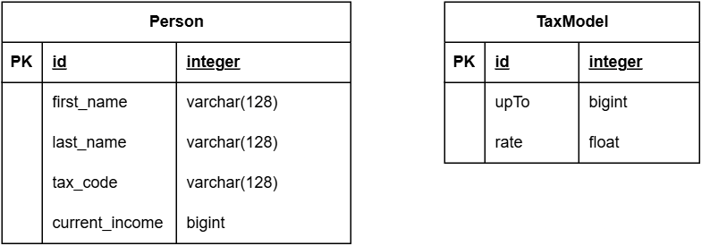

# Day one exercise

## Given this context

- The data model is defined as below
- The tax model will be pre-configured from the database by the following script
- Some person data will be initiate by the below script
- By examining the range of a given income, we can determine the applicable tax rate from the tax model. The tax amount can then be calculated using the formula: **income * tax rate**.

## Data model



## Personal income tax model

```sql
INSERT INTO TaxModel ("id", "upTo", "rate") VALUES (1, 5000000, 0.05);
INSERT INTO TaxModel ("id", "upTo", "rate") VALUES (2, 10000000, 0.1);
INSERT INTO TaxModel ("id", "upTo", "rate") VALUES (3, 18000000, 0.15);
INSERT INTO TaxModel ("id", "upTo", "rate") VALUES (4, 32000000, 0.20);
INSERT INTO TaxModel ("id", "upTo", "rate") VALUES (5, 52000000, 0.25);
INSERT INTO Person ("id", "first_name", "last_name", "tax_code", "current_salary") VALUES (1, 'John', 'Doe', 'TX123456', 5000000);
INSERT INTO Person ("id", "first_name", "last_name", "tax_code", "current_salary") VALUES (2, 'Jane', 'Smith', 'TX789012', 55000000);
INSERT INTO Person ("id", "first_name", "last_name", "tax_code", "current_salary") VALUES (3, 'Emily', 'Jones', 'TX345678', 16000000);
INSERT INTO Person ("id", "first_name", "last_name", "tax_code", "current_salary") VALUES (4, 'Michael', 'Brown', 'TX901234', 20000000);

```

## Requirements

- Initiate a Spring boot project with:
  - Maven
  - H2 database
  - Liquibase
  - JPA
- Define the database schema using liquibase changelog
- Define another liquibase changelog for the sample data
- Implement an API to get the current personal income tax model
- Implement an API to calculate the personal income tax for a person by their id
  - The inputted id must be validated before use for calculation
    - Must not be empty
    - Must be existed in the database
  - The response must contains:
    - The amount of tax
    - The applied tax rate